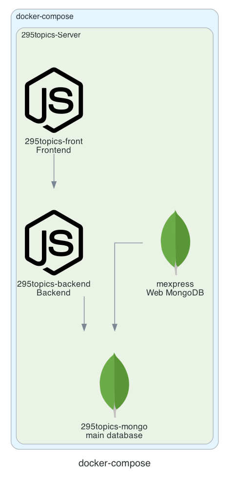
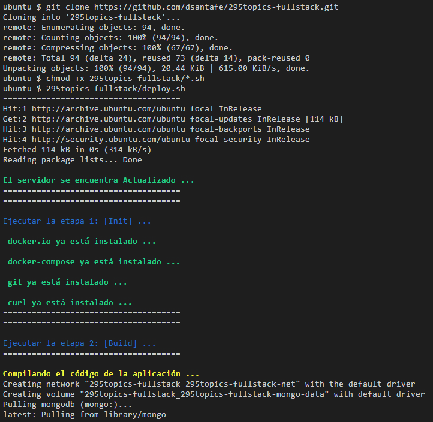
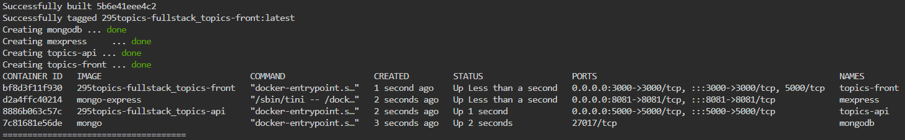
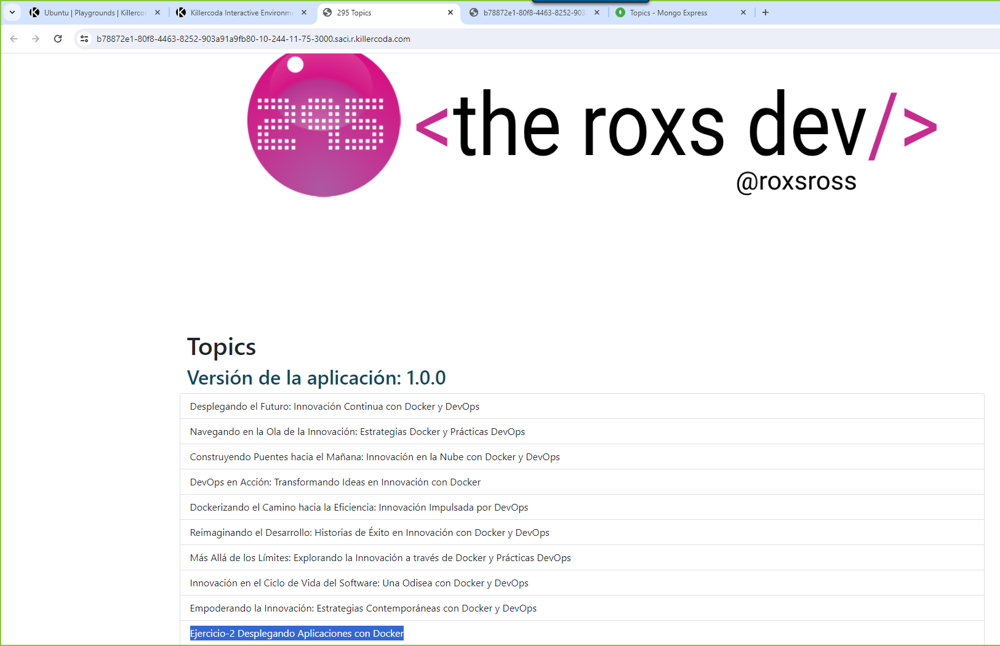
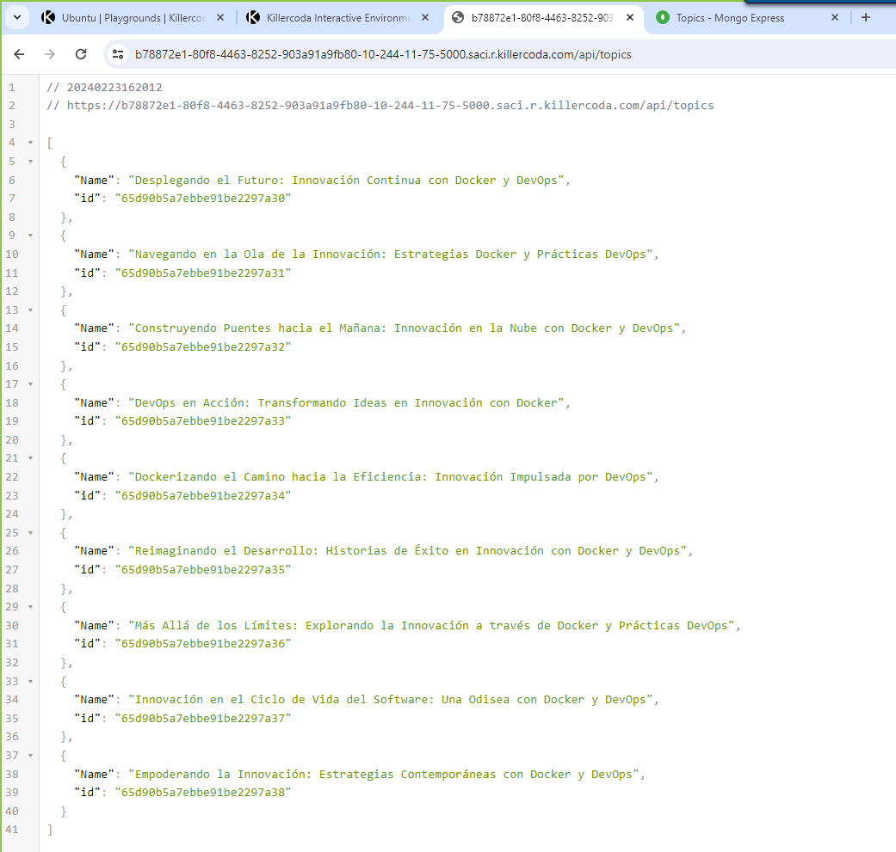
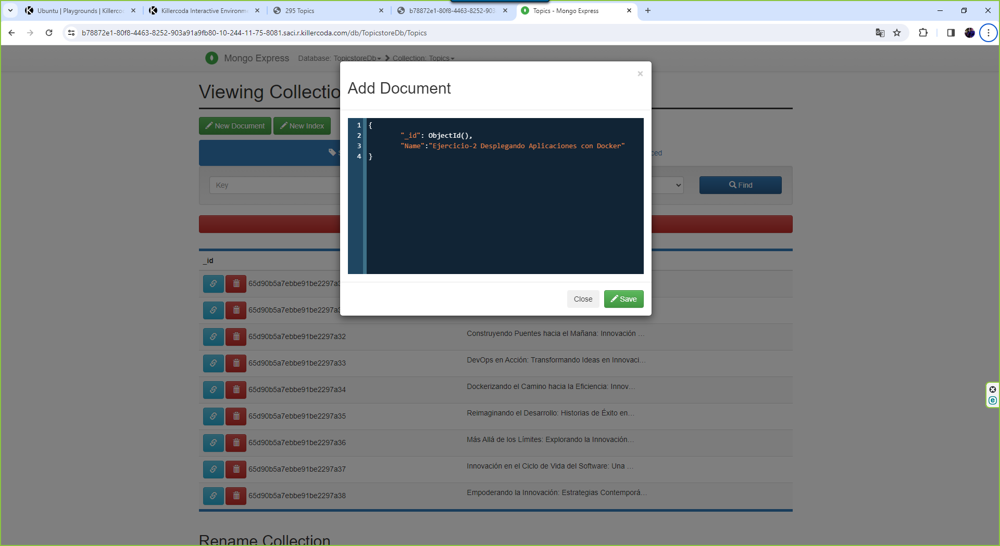

# Ejercicio-2 Desplegando Aplicaciones con Docker

- **295topics-fullstack**: Aquí, te enfrentarás a un desafío completo de pila completa. La aplicación "295topics" consta de un frontend y un backend. Deberás contenerizar ambos componentes utilizando Docker. Además, configurarás una base de datos MongoDB con datos iniciales y orquestarás todo el entorno utilizando Docker Compose.

# Despliegue la Aplicación '295topics' con Docker y Docker Compose

## Descripción del Desafío:

El desafío se centra en la configuración de la aplicación "295topics" que consta de un frontend Node.js, un backend TypeScript y una base de datos MongoDB utilizando contenedores Docker y Docker Compose.

El objetivo es asegurar que la aplicación sea escalable, fácil de administrar y se pueda desplegar de manera eficiente.

## Arquitectura:

Debes aplicar tus habilidades de DevOps para containerizar y gestionar la aplicación "295topics".

Esta aplicación consta de tres componentes principales:

- Frontend en Node.js y Express: Este componente sirve contenido web en el puerto 3000. Deberás crear un Dockerfile para el frontend, construir la imagen y publicarla en Docker Hub.

- Backend en TypeScript: Este componente se ejecuta en el puerto 5000 y se conecta a una base de datos MongoDB. Deberás crear un Dockerfile para el backend, construir la imagen y publicarla en Docker Hub.

- Base de Datos MongoDB: La base de datos se iniciará a través de un contenedor de MongoDB. Además, deberás proporcionar un archivo mongo-init.js que cargue datos iniciales en la base de datos cuando se inicie el contenedor de MongoDB.



Este repositorio contiene los archivos y comandos necesarios para desplegar la aplicación 295topics-fullstack con Docker

---

## Requisitos:

### Frontend en Node.js y Express:

- Se proporciona el código fuente del frontend en Node.js y Express el mismo utiliza el puerto 3000 para exponerse a Internet.
- Crea un Dockerfile para el frontend que incluya todas las dependencias necesarias y establezca el comando de inicio.
- Construye la imagen del frontend utilizando el Dockerfile.
    - Dentro del proyecto /frontend se encuentra su respectivo [Dockerfile](/frontend/Dockerfile) con la configuración necesaria.
- Publica la imagen en Docker Hub.
    - [GitHub Actions - Frontend Build and Publish](/.github/workflows/topics-front-docker-publish.yml)
- Se debe tomar en cuenta que consume el endpoint del backend a traves de la variable API_URI en donde se conectara con el backend

Por ejemplo: API_URI: http://topics-api:5000/api/topics

### Backend en TypeScript:

- Se Proporciona el código fuente del backend en TypeScript que utiliza el puerto 5000 y se conecta a una base de datos MongoDB.
- Crea un Dockerfile para el backend que incluya todas las dependencias necesarias y establezca el comando de inicio.
- Construye la imagen del backend utilizando el Dockerfile.
    - Dentro del proyecto /backend se encuentra su respectivo [Dockerfile](/backend//Dockerfile) con la configuración necesaria.
- Publica la imagen en Docker Hub.
    - [GitHub Actions - Backend Build and Publish](/.github/workflows/topics-api-docker-publish.yml)

### Base de Datos MongoDB:

Se entrega archivo mongo-init.js en la [ruta](/db/mongo-init.js) que sirve para precargar datos a la base de datos MongoDB. Se debe Configura un contenedor Docker para ejecutar una instancia de MongoDB. Utiliza el archivo mongo-init.js para precargar datos en la base de datos.

- Dentro del archivo [Docker Compose](docker-compose.yml) se encuentra la 
configuración del contenedor mongodb la precarga de datos.
```yaml
mongodb:
    image: mongo
    container_name: mongodb
    environment:
      MONGO_INITDB_ROOT_USERNAME: ${MONGO_ROOT_USERNAME}
      MONGO_INITDB_ROOT_PASSWORD: ${MONGO_ROOT_PASSWORD}
    networks:
      - 295topics-fullstack-net
    volumes:
      - ./db/mongo-init.js:/docker-entrypoint-initdb.d/mongo-init.js:ro
      - 295topics-fullstack-mongo-data:/data/db
```

### Mongo Express:

Configura un contenedor Docker para ejecutar Mongo Express y asegura que esté conectado a la base de datos MongoDB.
```yaml
mongo-express:
    image: mongo-express
    container_name: mexpress
    restart: always
    environment:
      ME_CONFIG_MONGODB_ADMINUSERNAME: ${ME_CONFIG_ADMIN_USERNAME}
      ME_CONFIG_MONGODB_ADMINPASSWORD: ${ME_CONFIG_ADMIN_PASSWORD}
      ME_CONFIG_MONGODB_URL: ${DATABASE_URL}
      ME_CONFIG_BASICAUTH_USERNAME: ${ME_CONFIG_BASICAUTH_USERNAME}
      ME_CONFIG_BASICAUTH_PASSWORD: ${ME_CONFIG_BASICAUTH_PASSWORD}
    links:
      - mongodb
    ports:
      - "${ME_PORT}:8081"
    networks:
      - 295topics-fullstack-net
    depends_on:
      - mongodb
```

### Docker Compose:

- Crea un archivo docker-compose.yml que defina los servicios para el frontend, el backend, la base de datos MongoDB y Mongo Express.

- Establece las dependencias adecuadas entre los servicios para garantizar que se inicien en el orden correcto.

- Verifica que la aplicación se ejecuta correctamente con docker-compose up. Asegúrate de que el frontend puede comunicarse con el backend a través del endpoint correspondiente.

    - Despliegue de la aplicación con [Docker Compose](docker-compose.yml)
```bash
$ docker-compose -p 295topics-fullstack --env-file .env.dev up -d --build
$ docker ps
```

### Desafío Adicional:

Crea un script de automatización (por ejemplo, un script Bash) para la implementación de la aplicación en un entorno de producción.

- [Script Bash](deploy.sh)

```bash
$ git clone https://github.com/dsantafe/295topics-fullstack.git
$ chmod +x 295topics-fullstack/*.sh
$ 295topics-fullstack/deploy.sh 
```

- Ingrese el host de la aplicación: <host_url>
- Ingrese el token de acceso de tu bot de Discord: <token_discord>

## Resultados

1. Ejecución del Script Bash



2. Ejecución de los contenedores



3. Pruebas front
- Se puede realizar pruebas de conexion `http://localhost:3000`



4. Pruebas backend
- Se puede realizar pruebas de conexion `http://localhost:5000/api/topics`



5. Pruebas mongodb
- Pueden usar el contenedor para conectarse y revisar la ingesta de los datos o usar directamente mongo express



# Links
- Config repo: https://github.com/dsantafe/295topics-fullstack
- Killercoda Interactive Environments: https://killercoda.com/